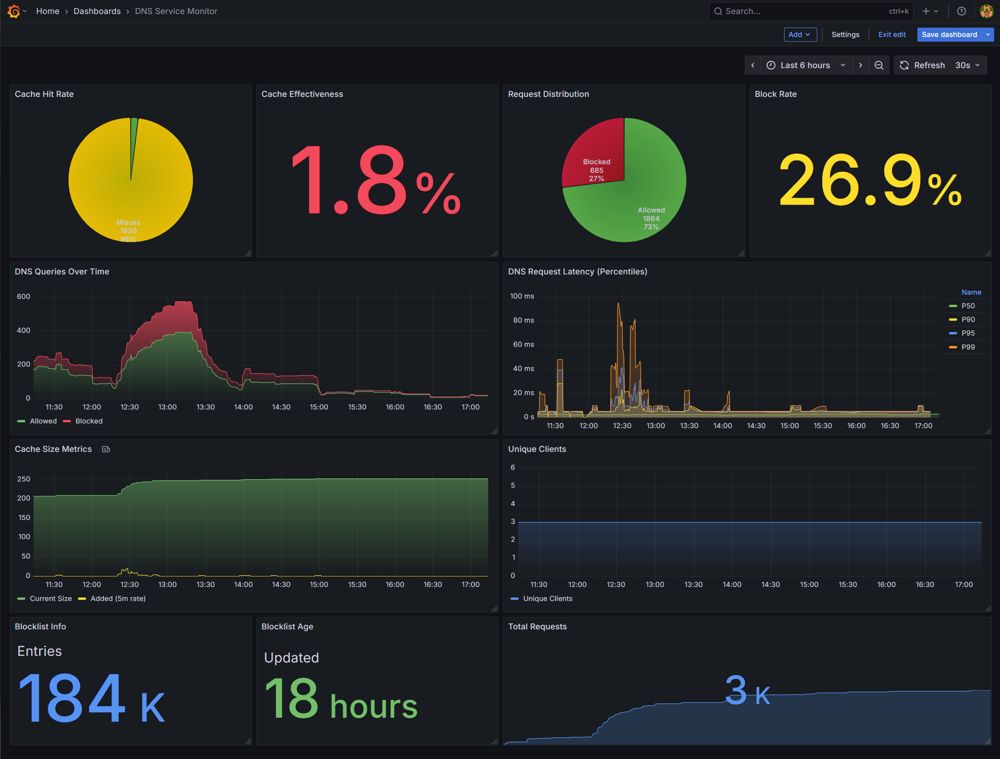

# DoT Block

DoT Block is a high-performance, caching, and filtering DNS-over-TLS (DoT) server written in Go. It acts as a secure DNS forwarder, encrypting your DNS queries and protecting you from advertisers, trackers, and malicious domains.

## Features

-   **DNS-over-TLS:** Encrypts your DNS queries to keep them private.
-   **Regular DNS:** Supports standard UDP and TCP DNS queries on port 53.
-   **Ad & Tracker Blocking:** Blocks a wide range of unwanted domains using customizable blocklists.
-   **High Performance:** Built with Go for speed and efficiency.
-   **Caching:** Caches DNS responses to speed up subsequent lookups.
-   **Easy to Deploy:** Can be run as a standalone binary or as a Docker container.
-   **Automatic TLS:** Uses Let's Encrypt to automatically obtain and renew TLS certificates.
-   **Prometheus Metrics:** Exports detailed metrics for monitoring.
-   **Error Reporting (Sentry):** Integrates with Sentry for real-time error tracking and reporting.

## Getting Started

### Docker (Recommended)

The easiest way to get started with DoT Block is to use Docker and Docker Compose.

1.  Clone this repository:
    ```bash
    git clone https://github.com/your-username/dot-block.git
    cd dot-block
    ```
2.  Update `docker-compose.yml` with your domain name and email address.
3.  Run the server:
    ```bash
    docker-compose up --build -d
    ```

The server will be accessible at `dot.your-domain.com`.

### Local Development

For local development, you can run the server in "dev mode", which uses plain TCP instead of TLS.

1.  Clone this repository:
    ```bash
    git clone https://github.com/your-username/dot-block.git
    cd dot-block
    ```
2.  Run the server:
    ```bash
    go run main.go --dev-mode --http-port=8080
    ```
    The DNS server (UDP/TCP) will be listening on port `8053`, DoT (plain TCP) on `8853`, and the HTTP server on port `8080`.

## Usage

You can test the server using `dig` or `openssl`.

### `dig`

**Regular DNS (UDP/TCP):**

```bash
dig @dot.your-domain.com -p 53 example.com A
```

**Production (TLS):**

```bash
dig @dot.your-domain.com -p 853 +tls example.com A
```

Note that the bundled `dig` binary in MacOS doesn't support the `+tls` options, so use an alternative like [kdig](https://www.knot-dns.cz/docs/2.6/html/man_kdig.html) instead.

**Local Development:**

```bash
# Regular DNS (UDP)
dig @127.0.0.1 -p 8053 www.google.com A

# Regular DNS (TCP)
dig @127.0.0.1 -p 8053 www.google.com A +tcp

# DoT (plain TCP)
dig @127.0.0.1 -p 8853 www.google.com A +tcp
```

### `openssl`

```bash
openssl s_client -connect dot.your-domain.com:853 -alpn dot -servername dot.your-domain.com
```

### iOS / iPadOS Configuration

To use DoT Block on your iPhone or iPad, you can install a configuration profile directly from the server:

1.  Open Safari on your iOS device.
2.  Navigate to `https://dot.your-domain.com/.mobileconfig`.
3.  Tap **Allow** when prompted to download the configuration profile.
4.  Open the **Settings** app.
5.  Tap **Profile Downloaded** near the top.
6.  Tap **Install** in the top right corner and follow the prompts.
7.  Once installed, your device will use DoT Block for all DNS queries.

## Building

To build the binary from source:

```bash
go build -ldflags="-w -s" -o dot-block .
```

## Testing

To run the tests:

```bash
go test ./...
```

## Configuration

DoT Block can be configured using the following command-line flags:

| Flag | Description | Default |
| :--- | :--- | :--- |
| `--allowed-host` | List of domains used for the CertManager allow policy. | `nil` |
| `--blocklist-url` | URL of the blocklist (wildcard hostname format). | `https://gitlab.com/hagezi/mirror/-/raw/main/dns-blocklists/wildcard/pro-onlydomains.txt` |
| `--cron-schedule:cache-reaper` | Cron spec for cache reaper. | `@every 10m` |
| `--cron-schedule:downloader` | Cron spec for reloading blocklist. | `@every 19h` |
| `--data-dir` | Directory for persisting data (e.g. TLS certificate cache). | `./data` |
| `--dev-mode` | Run the server in dev mode (no TLS, plain TCP). | `false` |
| `--dns-port` | The port to run regular DNS (UDP/TCP) server on. | `53` |
| `--dot-port` | The port to run DNS-over-TLS server on. | `853` |
| `--http-port` | The port to run the HTTP server on. | `80` |
| `--metrics-auth` | Credentials for basic auth on `/metrics` (format: `user:pass`). | `""` |
| `--no-dns-logging` | Disable all DNS query logging. | `false` |
| `--upstream` | Upstream DNS resolvers to forward queries to. | `8.8.8.8:53`, `8.8.4.4:53`, `1.1.1.1:53`, `1.0.0.1:53`, `9.9.9.9:53`, `149.112.112.112:53` |

### Environment Variables

| Variable | Description | Required |
| :--- | :--- | :--- |
| `ACME_EMAIL` | Email address used for Let's Encrypt registration. | Yes (in production) |
| `CLOUDFLARE_API_TOKEN` | Cloudflare API token for DNS-01 challenge (CertManager). | Yes (in production) |
| `DEV_MODE` | Set to `true` to enable development mode (disables TLS). | No |
| `SENTRY_DSN` | DSN for Sentry error reporting. | No |

## Grafana Dashboard

A [dashboard.json](./dashboard.json) is available for importing into Grafana:



## Contributing

Contributions are welcome! Please feel free to open an issue or submit a pull request.

## License

This project is licensed under the MIT License. See the [LICENSE.md](LICENSE.md) file for details.
