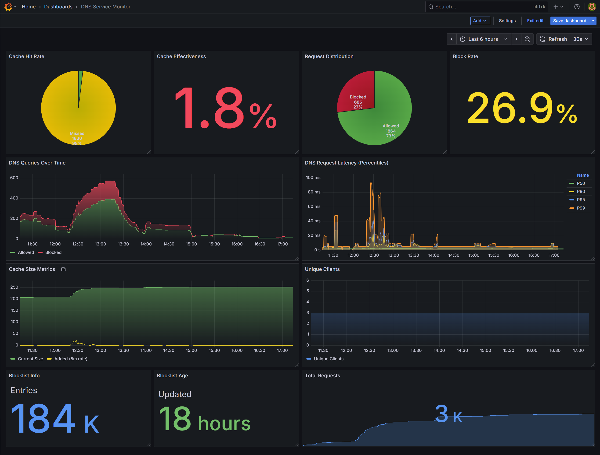

# DoT Block

DoT Block is a high-performance, caching, and filtering DNS-over-TLS (DoT) server written in Go. It acts as a secure DNS forwarder, encrypting your DNS queries and protecting you from advertisers, trackers, and malicious domains.

## Features

-   **DNS-over-TLS:** Encrypts your DNS queries to keep them private.
-   **DNS-over-HTTPS (DoH) endpoint:** An HTTP DoH handler is available at `/dns-query` that accepts GET requests with a `?dns=<base64url>` query parameter or POST requests with the raw DNS wire format in the request body. Responses are returned with content type `application/dns-message`.
-   **Regular DNS:** Supports standard UDP and TCP DNS queries (optional, disabled by default).
-   **Ad & Tracker Blocking:** Blocks a wide range of unwanted domains using customizable blocklists.
-   **High Performance:** Built with Go for speed and efficiency.
-   **Intelligent Caching:** Caches DNS responses to speed up subsequent lookups with configurable TTL flooring.
-   **Easy to Deploy:** Can be run as a standalone binary or as a Docker container.
-   **Automatic TLS:** Uses Let's Encrypt to automatically obtain and renew TLS certificates.
-   **Advanced Observability:** Exports detailed Prometheus metrics including upstream health, failure reasons, and cache effectiveness.
-   **Real-time Request Streaming:** An admin-only SSE endpoint streams live DNS requests, including client IP, location data (ASN/Country), and blocking status.
-   **Latency-Aware Routing:** Automatically prefers the fastest upstream resolvers based on real-time response latency and applies penalties to failing servers to ensure high availability.
-   **Hardened TLS:** Uses a strict TLS configuration (TLS 1.2+) with forward-secrecy prioritized cipher suites to ensure maximum security for DoT connections.
-   **Distributed Tracing:** Integrates with OpenTelemetry (OTel), providing end-to-end traces of DNS requests and correlating them with logs via `trace_id` and `span_id`.
-   **Noise-Reduced Error Reporting:** Integrates with Sentry, with intelligent filtering to avoid logging protocol-valid negative responses (like NXDOMAIN or NOTIMP) as errors.
-   **Proxy Protocol Support:** Supports PROXY protocol for DoT connections, enabling correct client IP identification when running behind a proxy.

## Getting Started

### Docker (Recommended)

The easiest way to get started with DoT Block is to use Docker and Docker Compose.

1.  Clone this repository:
    ```bash
    git clone https://github.com/your-username/dot-block.git
    cd dot-block
    ```
2.  Update `docker-compose.yml` with your domain name and email address.
3.  Run the server:
    ```bash
    docker-compose up --build -d
    ```

The server will be accessible at `dot.your-domain.com`.

#### Production Tuning

For high-traffic environments, you may need to tune the network stack to avoid port exhaustion and packet loss. You can apply these settings directly in your `docker-compose.yml` using `sysctls`:

```yaml
services:
  dot-block:
    # ... other configuration ...
    sysctls:
      - net.ipv4.ip_local_port_range=1024 65535
      - net.core.rmem_max=26214400
      - net.core.wmem_max=26214400
```

- `net.ipv4.ip_local_port_range`: Expands the ephemeral port range to allow more concurrent outgoing UDP requests.
- `net.core.rmem_max` & `net.core.wmem_max`: Increases the maximum OS receive and send buffer sizes for UDP to prevent packet drops during traffic spikes.

### Advanced Setup: Local DNSSEC with Unbound

By default, DoT Block forwards queries to public resolvers. While these typically perform DNSSEC validation, you can implement **local DNSSEC validation** by using [Unbound](https://nlnetlabs.nl/projects/unbound/about/) as your upstream resolver. This removes the need to trust a third-party provider for validation.

The easiest way to achieve this is by running Unbound in a separate container on the same Docker network.

**Example `docker-compose.yml` snippet:**

```yaml
services:
  unbound:
    image: mvance/unbound:latest
    container_name: unbound
    restart: unless-stopped
    # No ports exposed to the host; only accessible internally by dot-block

  dot-block:
    image: your-username/dot-block:latest
    # ... other configuration ...
    command: ["--upstreams=unbound:53"]
    depends_on:
      - unbound
```

In this configuration, `dot-block` handles the TLS termination, ad-blocking, and caching, while `unbound` performs the actual recursive resolution and DNSSEC validation.

### Local Development

For local development, you can run the server in "dev mode", which uses plain TCP instead of TLS.

1.  Clone this repository:
    ```bash
    git clone https://github.com/your-username/dot-block.git
    cd dot-block
    ```
2.  Run the server:
    ```bash
    go run main.go --dev-mode --http-port=8080
    ```
    The DNS server (UDP/TCP) will be listening on port `8053`, DoT (plain TCP) on `8853`, and the HTTP server on port `8080`.

## Usage

You can test the server using `dig` or `openssl`.

### `dig`

**Regular DNS (UDP/TCP, if configured):**

```bash
dig @dot.your-domain.com -p <DNS_PORT> example.com A
```

**Production (TLS/HTTPS):**

```bash
# DNS-over-TLS
dig @dot.your-domain.com -p 853 +tls example.com

# DNS-over-HTTPS
dig @dot.your-domain.com -p 443 +https example.com A
```

Note that the bundled `dig` binary in MacOS doesn't support the `+tls` options, so use an alternative like [kdig](https://www.knot-dns.cz/docs/2.6/html/man_kdig.html) instead.

**Local Development:**

```bash
# Regular DNS (UDP)
dig @127.0.0.1 -p 8053 www.google.com A

# Regular DNS (TCP)
dig @127.0.0.1 -p 8053 www.google.com A +tcp

# DoT (plain TCP)
dig @127.0.0.1 -p 8853 www.google.com A +tcp
```

### `openssl`

```bash
openssl s_client -connect dot.your-domain.com:853 -alpn dot -servername dot.your-domain.com
```

### Management API

The server provides several HTTP endpoints for monitoring and management on the configured `--http-port` (default 80).

#### Public endpoints

- `GET /metrics`: Exports Prometheus metrics.
- `GET /healthz`: Simple heathcheck.
- `GET /dns-query` and `POST /dns-query`: DNS-over-HTTPS (DoH) endpoint. `GET /dns-query` expects a `dns` query parameter containing the base64url-encoded DNS wire message. `POST /dns-query` expects the raw DNS wire format in the request body. Responses are returned with content type `application/dns-message`.

If `--metrics-auth` is configured, the `/metrics` endpoint is protected by basic authentication.

#### Admin endpoints

While the public endpoints are available on the main domain, the management APIs are hosted on the admin subdomain (e.g., `admin.dot.your-domain.com`):

- `POST /api/blocklist/reload`: Triggers an asynchronous reload of the blocklists.
- `POST /api/blocklist/check`: Checks whether provided domains are blocked. Accepts a JSON array of strings or a newline-separated list of domains in the request body.
- `GET /api/whoami`: Returns information about the currently authenticated user.
- `GET /api/events`: Streams live DNS requests via Server-Sent Events (SSE). Each event is a JSON object containing the queried domain, client IP, source (UDP/TCP/DoT/DoH), whether it was blocked, and GeoIP data (ASN and Country ISO code).

### Testing the Event Stream

You can stream live DNS requests using `curl`:

```bash
curl -N -H "Accept: text/event-stream" http://admin.localhost:8080/api/events
```

### iOS / iPadOS Configuration

To use DoT Block on your iPhone or iPad, you can install a configuration profile directly from the server:

1.  Open Safari on your iOS device.
2.  Navigate to `https://dot.your-domain.com/.mobileconfig`.
3.  Tap **Allow** when prompted to download the configuration profile.
4.  Open the **Settings** app.
5.  Tap **Profile Downloaded** near the top.
6.  Tap **Install** in the top right corner and follow the prompts.
7.  Once installed, your device will use DoT Block for all DNS queries.

### Browser Configuration (DoH)

You can configure your browser to use DoT Block for DNS queries directly, without changing any system-wide settings.

**Generic URL:** `https://dot.your-domain.com/dns-query`

#### Google Chrome
1.  Open **Settings** -> **Privacy and security** -> **Security**.
2.  Scroll down to **Use secure DNS**.
3.  Select **With: Custom** and enter your DoH URL: `https://dot.your-domain.com/dns-query`.

#### Mozilla Firefox
1.  Open **Settings** -> **Privacy & Security**.
2.  Scroll down to **DNS over HTTPS**.
3.  Select **Max Protection** or **Increased Protection**.
4.  Under **Choose provider**, select **Custom** and enter your DoH URL: `https://dot.your-domain.com/dns-query`.

#### Safari (macOS/iOS)
Safari uses the system DNS settings. To use DoH in Safari, you must configure it at the OS level (see [iOS Configuration](#ios--ipados-configuration) or your macOS network settings).

## Building

To build the binary from source:

```bash
go build -ldflags="-w -s" -o dot-block .
```

## Testing

To run the tests:

```bash
go test ./...
```

## Configuration

DoT Block can be configured using the following command-line flags:

| Flag | Description | Default |
| :--- | :--- | :--- |
| `--allowed-hosts` | List of domains used for the CertManager allow policy. | `nil` |
| `--blocklist-url` | List of URL blocklists (wildcard hostname format). | `https://codeberg.org/hagezi/mirror2/raw/branch/main/dns-blocklists/hosts/pro.txt`, `https://raw.githubusercontent.com/rm-hull/dot-block/refs/heads/main/data/blocklist.txt` |
| `--noise-filter-url` | URL of noise filter (CSV format: category,rcode,domain_suffix). | `https://raw.githubusercontent.com/rm-hull/dot-block/refs/heads/main/data/noise-filter.txt` |
| `--cache-ttl-floor` | Minimum TTL for cached entries (in seconds). If a response is not "freshness sensitive" (e.g. contains `ocsp`, `crl`, `pki` or is `SOA`/`TXT`), the cache TTL will be at least this value. | `3600s` |
| `--dial-timeout` | Timeout for establishing TCP connections to upstream servers | `300ms` |
| `--read-timeout` | Timeout for waiting for responses from upstream DNS servers | `300ms` |
| `--write-timeout` | Timeout for writing upstream DNS queries | `100ms` |
| `--cron-schedule:cache-reaper` | Cron spec for cache reaper. | `0 3 * * *` (3:00am every day) |
| `--cron-schedule:downloader` | Cron spec for reloading blocklist. | `@every 19h` |
| `--cron-schedule:ipinfo` | Cron spec for fetching ipinfo.io geoIP database. | `5 7 4 * *` (7:05am on the 4th of every month) |
| `--data-dir` | Directory for persisting data (e.g. TLS certificate cache). | `./data` |
| `--dev-mode` | Run the server in dev mode (no TLS, plain TCP). | `false` |
| `--dns-port` | The port to run regular DNS (UDP/TCP) server on. If omitted, the regular DNS server will not start. | `0` |
| `--dot-port` | The port to run DNS-over-TLS server on. | `853` |
| `--http-port` | The port to run the HTTP server on. | `80` |
| `--log-level` | The log level (DEBUG, INFO, WARN, ERROR). | `INFO` |
| `--metrics-auth` | Credentials for basic auth on `/metrics` (format: `user:pass`). | `""` |
| `--require-proxy-protocol` | Require PROXY protocol header for DoT connections. | `false` |
| `--trusted-proxies` | Comma-separated list of trusted proxy IP addresses or CIDR ranges. | `nil` |
| `--enable-ecs` | Enable EDNS0 Client Subnet (ECS) steering. This allows the server to send the client's network prefix to upstream resolvers for location-aware responses. | `false` |
| `-v, --version` | Print the version of the server and exit. | `nil` |
| `--upstreams` | Upstream DNS resolvers to forward queries to. (Port 53 is assumed if omitted) | `8.8.8.8`, `8.8.4.4`, `1.1.1.1`, `1.0.0.1`, `9.9.9.9`, `149.112.112.112` |

### Environment Variables

| Variable | Description | Required |
| :--- | :--- | :--- |
| `ACME_EMAIL` | Email address used for Let's Encrypt registration. | Yes (in production) |
| `CLOUDFLARE_API_TOKEN` | Cloudflare API token for DNS-01 challenge (CertManager). | Yes (in production) |
| `DEV_MODE` | Set to `true` to enable development mode (disables TLS). | No |
| `IPINFO_TOKEN` | IPInfo.io token for downloading geoIP locations. | Yes (if geoblocking enabled) |
| `SENTRY_DSN` | DSN for Sentry error reporting. | No |
| `OTEL_EXPORTER_OTLP_ENDPOINT` | OpenTelemetry OTLP gRPC endpoint (e.g. `localhost:4317`). | No |
| `OTEL_SAMPLING_RATIO` | Ratio of traces to sample (0.0 to 1.0). Defaults to `0.01` (1%). | No |

## Grafana Dashboard

A [dashboard.json](./dashboard.json) is available for importing into Grafana:



## Contributing

Contributions are welcome! Please feel free to open an issue or submit a pull request.

## License

This project is licensed under the MIT License. See the [LICENSE.md](LICENSE.md) file for details.
