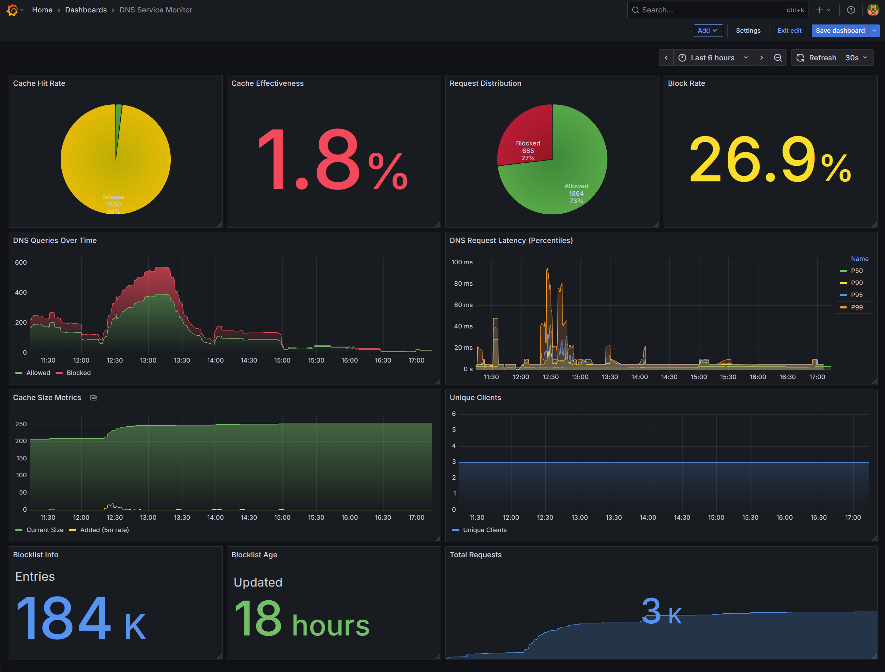

# DoT Block

DoT Block is a high-performance, caching, and filtering DNS-over-TLS (DoT) server written in Go. It acts as a secure DNS forwarder, encrypting your DNS queries and protecting you from advertisers, trackers, and malicious domains.

## Features

- **DNS-over-TLS:** Encrypts your DNS queries to keep them private.
- **DNS-over-HTTPS (DoH) endpoint:** An HTTP DoH handler is available at `/dns-query` that accepts GET requests with a `?dns=<base64url>` query parameter or POST requests with the raw DNS wire format in the request body. Responses are returned with content type `application/dns-message`.
- **Regular DNS:** Supports standard UDP and TCP DNS queries (optional, disabled by default).
- **Ad & Tracker Blocking:** Blocks a wide range of unwanted domains using customizable blocklists.
- **High Performance:** Built with Go for speed and efficiency.
- **Intelligent Caching:** Caches DNS responses to speed up subsequent lookups with configurable TTL flooring.
- **Easy to Deploy:** Can be run as a standalone binary or as a Docker container.
- **Automatic TLS:** Uses Let's Encrypt to automatically obtain and renew TLS certificates.
- **Advanced Observability:** Exports detailed Prometheus metrics including upstream health, failure reasons, and cache effectiveness.
- **Real-time Request Streaming:** An admin-only SSE endpoint streams live DNS requests, including client IP, location data (ASN/Country), and blocking status.
- **Latency-Aware Routing:** Automatically prefers the fastest upstream resolvers based on real-time response latency and applies penalties to failing servers to ensure high availability.
- **Hardened TLS:** Uses a strict TLS configuration (TLS 1.2+) with forward-secrecy prioritized cipher suites to ensure maximum security for DoT connections.
- **Distributed Tracing:** Integrates with OpenTelemetry (OTel), providing end-to-end traces of DNS requests and correlating them with logs via `trace_id` and `span_id`.
- **Noise-Reduced Error Reporting:** Integrates with Sentry, with intelligent filtering to avoid logging protocol-valid negative responses (like NXDOMAIN or NOTIMP) as errors.
- **Proxy Protocol Support:** Supports PROXY protocol for DoT connections, enabling correct client IP identification when running behind a proxy.

## Getting Started

### Docker (Recommended)

The easiest way to get started with DoT Block is to use Docker and Docker Compose.

1.  Clone this repository:
    ```bash
    git clone https://github.com/your-username/dot-block.git
    cd dot-block
    ```
2.  Update `docker-compose.yml` with your domain name and email address.
3.  Run the server:
    ```bash
    docker-compose up --build -d
    ```

The server will be accessible at `dot.your-domain.com`.

#### Production Tuning

For high-traffic environments, you may need to tune the network stack to avoid port exhaustion and packet loss. You can apply these settings directly in your `docker-compose.yml` using `sysctls`:

```yaml
services:
    dot-block:
        # ... other configuration ...
        sysctls:
            - net.ipv4.ip_local_port_range=1024 65535
            - net.core.rmem_max=26214400
            - net.core.wmem_max=26214400
```

- `net.ipv4.ip_local_port_range`: Expands the ephemeral port range to allow more concurrent outgoing UDP requests.
- `net.core.rmem_max` & `net.core.wmem_max`: Increases the maximum OS receive and send buffer sizes for UDP to prevent packet drops during traffic spikes.

### Advanced Setup: Local DNSSEC with Unbound

By default, DoT Block forwards queries to public resolvers. While these typically perform DNSSEC validation, you can implement **local DNSSEC validation** by using [Unbound](https://nlnetlabs.nl/projects/unbound/about/) as your upstream resolver. This removes the need to trust a third-party provider for validation.

The easiest way to achieve this is by running Unbound in a separate container on the same Docker network.

**Example `docker-compose.yml` snippet:**

```yaml
services:
    unbound:
        image: mvance/unbound:latest
        container_name: unbound
        restart: unless-stopped
        # No ports exposed to the host; only accessible internally by dot-block

    dot-block:
        image: your-username/dot-block:latest
        # ... other configuration ...
        command: ["--upstreams=unbound:53"]
        depends_on:
            - unbound
```

In this configuration, `dot-block` handles the TLS termination, ad-blocking, and caching, while `unbound` performs the actual recursive resolution and DNSSEC validation.

### Local Development

For local development, you can run the server in "dev mode", which uses plain TCP instead of TLS.

1.  Clone this repository:
    ```bash
    git clone https://github.com/your-username/dot-block.git
    cd dot-block
    ```
2.  Run the server:
    ```bash
    go run main.go --config=.vscode/config.yaml
    ```
    The DNS server (UDP/TCP) will be listening on port `8053`, DoT (plain TCP) on `8853`, and the HTTP server on port `8080`.

### Benchmarking

To run the benchmarks for the DNS dispatcher and related components:

```bash
go test -bench=. -benchmem ./internal/forwarder/
```

This will run all benchmarks in the `internal/forwarder` package, including:

- DNSDispatcher cache hit/miss/blocked/etc.
- Concurrent dispatcher benchmark
- DNSCache get/set
- RoundRobinClient

Example output:

```
goos: darwin
goarch: arm64
pkg: github.com/rm-hull/dot-block/internal/forwarder
cpu: Apple M2 Pro
BenchmarkDNSDispatcher/CacheHit-10     	  314172	      3820 ns/op	    2350 B/op	      43 allocs/op
BenchmarkDNSDispatcher/CacheMiss-10    	    3376	    367098 ns/op	    6389 B/op	     108 allocs/op
...
PASS
ok  	github.com/rm-hull/dot-block/internal/forwarder	19.243s
```

Benchmark tests will run for main and every PR. The results are collected and visible here: https://www.destructuring-bind.org/dot-block/dev/bench/

## Usage

You can test the server using `dig` or `openssl`.

### `dig`

**Regular DNS (UDP/TCP, if configured):**

```bash
dig @dot.your-domain.com -p <DNS_PORT> example.com A
```

**Production (TLS/HTTPS):**

```bash
# DNS-over-TLS
dig @dot.your-domain.com -p 853 +tls example.com

# DNS-over-HTTPS
dig @dot.your-domain.com -p 443 +https example.com A
```

Note that the bundled `dig` binary in MacOS doesn't support the `+tls` options, so use an alternative like [kdig](https://www.knot-dns.cz/docs/2.6/html/man_kdig.html) instead.

**Local Development:**

```bash
# Regular DNS (UDP)
dig @127.0.0.1 -p 8053 www.google.com A

# Regular DNS (TCP)
dig @127.0.0.1 -p 8053 www.google.com A +tcp

# DoT (plain TCP)
dig @127.0.0.1 -p 8853 www.google.com A +tcp
```

### `openssl`

```bash
openssl s_client -connect dot.your-domain.com:853 -alpn dot -servername dot.your-domain.com
```

### Management API

The server provides several HTTP endpoints for monitoring and management on the configured HTTP port (default 80).

#### Public endpoints

- `GET /metrics`: Exports Prometheus metrics.
- `GET /healthz`: Simple heathcheck.
- `GET /dns-query` and `POST /dns-query`: DNS-over-HTTPS (DoH) endpoint. `GET /dns-query` expects a `dns` query parameter containing the base64url-encoded DNS wire message. `POST /dns-query` expects the raw DNS wire format in the request body. Responses are returned with content type `application/dns-message`.

If `metrics_auth` is configured, the `/metrics` endpoint is protected by basic authentication.

#### Admin endpoints

While the public endpoints are available on the main domain, the management APIs are hosted on the admin subdomain (e.g., `admin.dot.your-domain.com`). Admin API requests must authenticate using one of two methods:

- `X-API-Key` header with a value defined in `server.api_keys`
- Proxy auth headers: `X-Auth-Request-User` and optional `X-Auth-Request-Email`

These proxy auth headers are typically populated by a reverse proxy such as Traefik and an OAuth2/auth proxy plugin.

If both are present, `X-API-Key` is validated first.

- `POST /api/blocklist/reload`: Triggers an asynchronous reload of all configured blocklists.
- `GET /api/blocklist/status`: Returns the current status of all blocklists, including metadata, record counts, and enabled status.
- `POST /api/blocklist/disable`: Temporarily disables one or all blocklists. Requires a JSON payload: `{"name": "...", "duration": "1h"}`. The `duration` field accepts both Go duration format (e.g. `1h`, `30m`, `90s`) and ISO 8601 duration format (e.g. `PT1H`, `PT30M`, `P1D`).
- `POST /api/blocklist/reenable`: Re-enables all blocklists.
- `POST /api/blocklist/check`: Checks whether provided domains are blocked against any of the enabled blocklists. Accepts a JSON array of strings or a newline-separated list of domains in the request body.
- `GET /api/whoami`: Returns information about the currently authenticated user.
- `GET /api/version-info`: Returns the application version (`app_version`), Go runtime version (`go_version`), and server uptime in seconds (`uptime`).
- `GET /api/events`: Streams live DNS requests via Server-Sent Events (SSE). Each event is a JSON object containing the queried domain, client IP, source (UDP/TCP/DoT/DoH), whether it was blocked, and GeoIP data (ASN and Country ISO code).
- `GET /api/events`: Streams live DNS requests via Server-Sent Events (SSE). Each event is a JSON object containing the queried domain, client IP, source (UDP/TCP/DoT/DoH), whether it was blocked, and GeoIP data (ASN and Country ISO code).

    Optional query parameters can be used to filter the streamed events:
    - `blocked=true|false` — when present, only events whose `blocked` field matches the boolean value will be sent.
    - `domain=<hostname>` — repeatable. When one or more `domain` parameters are provided the handler only streams events whose queried domain equals or is a subdomain of any of the provided values (suffix match). Examples:
        - `?domain=example.com` matches `example.com` and `www.example.com`.
        - `?domain=example.com&domain=other.com` matches any event under either suffix.

    Note on combining parameters: When multiple different query parameters are provided they are combined using logical AND — an event must satisfy every provided parameter to be streamed. The `domain` parameter is the exception in that it may be supplied multiple times; multiple `domain` values are treated as an OR (match any of the provided domain suffixes), and that OR result is then ANDed with the other parameters.

    Examples:
    - Stream only blocked events:

        ```bash
        curl -N -H "Accept: text/event-stream" "http://admin.localhost:8080/api/events?blocked=true"
        ```

    - Stream events for multiple domains (suffix match):

        ```bash
        curl -N -H "Accept: text/event-stream" "http://admin.localhost:8080/api/events?domain=example.com&domain=other.com"
        ```

### Testing the Event Stream

You can stream live DNS requests using `curl`:

```bash
curl -N -H "Accept: text/event-stream" http://admin.localhost:8080/api/events
```

### iOS / iPadOS Configuration

To use DoT Block on your iPhone or iPad, you can install a configuration profile directly from the server:

1.  Open Safari on your iOS device.
2.  Navigate to `https://dot.your-domain.com/.mobileconfig`.
3.  Tap **Allow** when prompted to download the configuration profile.
4.  Open the **Settings** app.
5.  Tap **Profile Downloaded** near the top.
6.  Tap **Install** in the top right corner and follow the prompts.
7.  Once installed, your device will use DoT Block for all DNS queries.

### Browser Configuration (DoH)

You can configure your browser to use DoT Block for DNS queries directly, without changing any system-wide settings.

**Generic URL:** `https://dot.your-domain.com/dns-query`

#### Google Chrome

1.  Open **Settings** -> **Privacy and security** -> **Security**.
2.  Scroll down to **Use secure DNS**.
3.  Select **With: Custom** and enter your DoH URL: `https://dot.your-domain.com/dns-query`.

#### Mozilla Firefox

1.  Open **Settings** -> **Privacy & Security**.
2.  Scroll down to **DNS over HTTPS**.
3.  Select **Max Protection** or **Increased Protection**.
4.  Under **Choose provider**, select **Custom** and enter your DoH URL: `https://dot.your-domain.com/dns-query`.

#### Safari (macOS/iOS)

Safari uses the system DNS settings. To use DoH in Safari, you must configure it at the OS level (see [iOS Configuration](#ios--ipados-configuration) or your macOS network settings).

## Building

To build the binary from source:

```bash
go build -ldflags="-w -s" -o dot-block .
```

## Testing

To run the tests:

```bash
go test ./...
```

## Configuration

DoT Block is configured via a YAML configuration file. The server searches for the config file in the following order:

1.  The path specified by the `--config` flag
2.  `config.yaml` or `config.yml` in the current directory
3.  `$XDG_CONFIG_DIRS/dot-block/config.yaml` (e.g., `/etc/xdg/dot-block/config.yaml`)
4.  `$XDG_CONFIG_HOME/dot-block/config.yaml` (e.g., `~/.config/dot-block/config.yaml`)

### Configuration File

A complete example configuration file. Environment variables can be substituted using `${VAR}` or `${VAR:-default}` syntax:

```yaml
# Optional: enables IDE validation/autocomplete (VS Code, etc.)
$schema: https://raw.githubusercontent.com/rm-hull/dot-block/main/config.schema.json

server:
  dev_mode: false                    # Run in dev mode (no TLS, plain TCP)
  log_level: INFO                    # Log level: DEBUG, INFO, WARN, ERROR
  data_dir: ./data                   # Directory for persistent data
  http_port: 80                      # HTTP server port
  dns_port: 0                        # Regular DNS port (0 = disabled)
  dot_port: 853                      # DNS-over-TLS port
  proxy_protocol:                    # PROXY protocol configuration
    enabled: false                   # Require PROXY protocol header for DoT
    trusted_proxies: []              # Trusted proxy IP addresses or CIDR ranges
  lets_encrypt:                      # Let's Encrypt / ACME certificate management
    enabled: false                   # Enable automatic TLS certificate management
    email: ""                        # Email address for Let's Encrypt registration
    cloudflare_api_token: ""         # Cloudflare API token for DNS-01 challenge
    allowed_hosts: []                # Domains for CertManager allow policy / mobileconfig
  api_keys:
    "key1": "API key for user 1"
    "key2": "API key for user 2"
    # API keys are used to authenticate admin API requests on the admin host.
    # Requests may also authenticate with proxy auth headers (X-Auth-Request-User / X-Auth-Request-Email).

dns:
  upstreams:                         # Upstream DNS resolvers
    - 8.8.8.8
    - 8.8.4.4
    - 1.1.1.1
    - 1.0.0.1
  ecs:
    enabled: false                   # Enable EDNS0 Client Subnet (ECS) steering
  cache:
    max_size: 1000000                # Maximum number of cached entries
    ttl_floor: 1h                    # Minimum TTL for cached entries (Go duration format)
    cron_schedule: "0 3 * * *"       # Cron spec for cache reaper
  noise_filter:
    url: "https://raw.githubusercontent.com/rm-hull/dot-block/refs/heads/main/data/noise-filter.csv"
    cron_schedule: "@every 19h"      # Cron spec for noise filter downloader
  timeouts:
    read: 300ms                      # Timeout for reading upstream DNS queries
    write: 100ms                     # Timeout for writing upstream DNS queries
    dial: 300ms                      # Timeout for establishing connections to upstreams

blocklist:
  sources:                           # Array of blocklist sources, each with its own name, URL and cron schedule (title and description are optional)
    - name: "hagezi-pro"             # Human-readable name for the blocklist
      url: "https://raw.githubusercontent.com/hagezi/dns-blocklists/refs/heads/main/hosts/pro.txt"
      cron_schedule: "@every 19h"    # Cron spec for reloading this specific blocklist
    - name: "cebeerre-nrd"
      url: "https://raw.githubusercontent.com/Cebeerre/dnsblocklists/refs/heads/main/NRD/nrd7_asterisk.txt"
      cron_schedule: "@every 23h"
    - name: "dot-block"
      title: "dot-block blocklist",
	  description: "internally curated blocklist, maintained at github.com/rm-hull/dot-block",
      url: "https://raw.githubusercontent.com/rm-hull/dot-block/refs/heads/main/data/blocklist.txt"
      cron_schedule: "@every 4h"

# Blocklists are fetched asynchronously on startup, so the DNS server begins
# listening immediately. Domains are not blocked until the initial fetch
# completes. Subsequent reloads are also asynchronous (see /api/blocklist/reload).

geoblock:
  ipinfo:
    enabled: true                    # Enable IPinfo.io geolocation lookups
    cron_schedule: "5 7 4 * *"       # Cron spec for Ipinfo.io database downloader
    token: ""                        # IPInfo.io API token for downloading geoIP database

telemetry:                           # Observability settings
  sentry_dsn: ""                     # DSN for Sentry error reporting
  metrics_auth: ""                   # Basic auth credentials for /metrics (user:pass)
  otel_endpoint: ""                  # OpenTelemetry OTLP gRPC endpoint (e.g. localhost:4317)
  otel_sampling_ratio: 0.01          # Ratio of traces to sample (0.0 to 1.0)
  top_k:                             # Top-K metric configuration
    num_domains: 100                 # Number of top (non-blocked) domains to track
    num_blocked: 100                 # Number of top blocked domains to track
    num_clients: 100                 # Number of top clients to track
```

All fields are optional — any omitted values fall back to defaults. The `$schema` directive enables IDE validation and autocomplete in editors like VS Code (with the YAML extension).

### Environment Variable Overrides

All configuration values can be overridden via environment variables:

| Variable                      | Description                                                                                               | Default  |
| :---------------------------- | :-------------------------------------------------------------------------------------------------------- | :------- |
| `DEV_MODE`                    | Set to `true` to enable development mode (disables TLS).                                                  | `false`  |
| `LOG_LEVEL`                   | The log level (DEBUG, INFO, WARN, ERROR).                                                                 | `INFO`   |
| `DATA_DIR`                    | Directory for storing persistent data.                                                                    | `./data` |
| `HTTP_PORT`                   | The port to run HTTP server on.                                                                           | `80`     |
| `DNS_PORT`                    | The port to run regular DNS (UDP/TCP) server on.                                                          | `0`      |
| `DOT_PORT`                    | The port to run DNS-over-TLS server on.                                                                   | `853`    |
| `REQUIRE_PROXY_PROTOCOL`      | Set to `true` to require PROXY protocol header.                                                           | `false`  |
| `TRUSTED_PROXIES`             | Comma-separated list of trusted proxy CIDRs (deprecated, use `proxy_protocol.trusted_proxies` in config). | `""`     |
| `METRICS_AUTH`                | Credentials for basic auth on `/metrics` (format: `user:pass`).                                           | `""`     |
| `ENABLE_ECS`                  | Set to `true` to enable EDNS0 Client Subnet (ECS) steering.                                               | `false`  |
| `DISABLE_IPINFO`              | Set to `true` to disable IPinfo.io geolocation lookups.                                                   | `false`  |
| `ACME_EMAIL`                  | Email address for Let's Encrypt registration (see `server.lets_encrypt.email`).                           | `""`     |
| `CLOUDFLARE_API_TOKEN`        | Cloudflare API token for DNS-01 challenge (see `server.lets_encrypt.cloudflare_api_token`).               | `""`     |
| `IPINFO_TOKEN`                | IPInfo.io token for downloading geoIP locations (see `geoblock.ipinfo.token`).                            | `""`     |
| `SENTRY_DSN`                  | DSN for Sentry error reporting (see `telemetry.sentry_dsn`).                                              | `""`     |
| `OTEL_EXPORTER_OTLP_ENDPOINT` | OpenTelemetry OTLP gRPC endpoint (see `telemetry.otel_endpoint`).                                         | `""`     |
| `OTEL_SAMPLING_RATIO`         | Ratio of traces to sample (0.0 to 1.0) (see `telemetry.otel_sampling_ratio`).                             | `0.01`   |

### Configuration Precedence

Configuration values are applied in the following order (later overrides earlier):

1.  **Defaults** — Built-in default values
2.  **Config file** (`config.yaml`) — With environment variable substitution (`${VAR:-default}` syntax)
3.  **Environment variables** — Override config file values
4.  **CLI flags** — Only `--config` and `--version` are available

### Regenerating the JSON Schema

The `config.schema.json` file is auto-generated from the Go structs in `internal/config/config.go`. To regenerate it after modifying the config structs:

```bash
go test ./internal/config -run TestSchemaGeneration
```

Never edit `config.schema.json` directly — the Go code is the source of truth.

## Grafana Dashboard

A [dashboard.json](./dashboard.json) is available for importing into Grafana:



## Contributing

Contributions are welcome! Please feel free to open an issue or submit a pull request.

## License

This project is licensed under the MIT License. See the [LICENSE.md](LICENSE.md) file for details.
